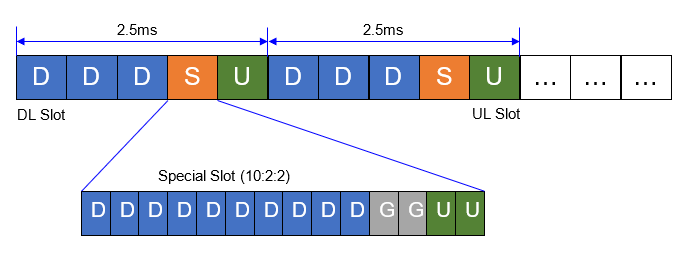

<table style="border-collapse: collapse; border: none;">
  <tr style="border-collapse: collapse; border: none;">
    <td style="border-collapse: collapse; border: none;">
      <a href="http://www.openairinterface.org/">
         
         </img>
      </a>
    </td>
    <td style="border-collapse: collapse; border: none; vertical-align: center;">
      <b><font size = "5">NR SA Multi TDD Pattern Configuratoin</font></b>
    </td>
  </tr>
</table>

This tutorial provides a guide on configuring the Time Division Duplex (TDD) patterns in an NR Standalone (SA) gNB within the OAI. This document provides a detailed explanation of configuring the Uplink and Downlink slots for the TDD configuration, as well as configure single and dual TDD patterns for different deployment scenarios.

[[_TOC_]]

The main TDD parameters are predefined in the gNB configuration file. It offers the possibility of using one or two TDD patterns depending on the desired customer configuration.



## Modify gNB Configuration File

### Single TDD Pattern
The user has to specify the main TDD configuration according to the desired UL and DL performance. The key parameters of TDD patterns in the gNB configuration file are defined as follows:

```plaintext
#dl_UL_TransmissionPeriodicity  0=ms0p5, 1=ms0p625, 2=ms1, 3=ms1p25, 4=ms2, 5=ms2p5, 6=ms5, 7=ms10, 8=ms3, 9=ms4

prach_ConfigurationIndex                                      = 98;
dl_UL_TransmissionPeriodicity                                 = 5;
nrofDownlinkSlots                                             = 3;
nrofDownlinkSymbols                                           = 10;
nrofUplinkSlots                                               = 1;
nrofUplinkSymbols                                             = 2;
```
prach_ConfigurationIndex:
------------------------ 

Used to determine the PRACH transmission time, indicating the number of subframes where the UE is allowed to transmit PRACH Preamble. The value of this parameter is calculated from Tables 6.3.3.2-2 to 6.3.3.2-4 in TS 38.211. For instance, for a TDD pattern of DDDSU, the appropriate prach_ConfigurationIndex value is 98.

ul_UL_TransmissionPeriodicity:
------------------------------ 

Refers to the UL/DL slots periodicity for the TDD pattern. This parameter can be set to one of the following values based on the required TDD period:

----------------------------------------------------
| dl_UL_TransmissionPeriodicity value | TDD period |
|-------------------------------------|------------|
| 0                                   | 0.5 ms     |
| 1                                   | 0.625 ms   |
| 2                                   | 1 ms       |
| 3                                   | 1.25 ms    |
| 4                                   | 2 ms       |
| 5                                   | 2.5 ms     |
| 6                                   | 5 ms       |
| 7                                   | 10 ms      |
----------------------------------------------------

- **nrofDownlinkSlots**: Refers to the number of consecutive DL slots in the TDD pattern. The number of DL slots depends on the TDD period.
- **nrofDownlinkSymbols**: Indicates the number of consecutive DL symbols within the special slot that follows the downlink slots in the TDD pattern. The special slot is needed only to switch from DL to UL. The maximum number of symbols in this slot is 14.
- **nrofUplinkSlots**: Refers to the number of consecutive UL slots in the TDD pattern, depending on the desired TDD period.
- **nrofUplinkSymbols**: Indicates the number of consecutive UL symbols within the special slot that follows the downlink slots in the TDD pattern. The sum of downlink and uplink symbols should not exceed 14.


## Dual TDD Patterns
In the case of two TDD patterns, the TDD parameters are defined as follows:

```
prach_ConfigurationIndex                      = 154;

#dl_UL_TransmissionPeriodicity  0=ms0p5, 1=ms0p625, 2=ms1, 3=ms1p25, 4=ms2, 5=ms2p5, 6=ms5, 7=ms10, 8=ms3, 9=ms4
# pattern1
dl_UL_TransmissionPeriodicity                 = 8;
nrofDownlinkSlots                             = 3;
nrofDownlinkSymbols                           = 6;
nrofUplinkSlots                               = 2;
nrofUplinkSymbols                             = 4;

# pattern2        
dl_UL_TransmissionPeriodicity2                = 4;
nrofDownlinkSlots2                            = 4;
nrofDownlinkSymbols2                          = 0;
nrofUplinkSlots2                              = 0;
nrofUplinkSymbols2                            = 0;
```

# Extended TDD Periodicity Values
- In this case, the TDD pattern may have two extended values of 3 ms and 4 ms. These values are standardized as dl-UL-TransmissionPeriodicity-v1530.

- For the sake of simplicity of the gNB configuration file, we have extended the set of dl-UL-TransmissionPeriodicity values to support the new TDD periods, as explained in the table below. However, these values will later be encoded as dl-UL-TransmissionPeriodicity-v1530 to match the specifications.

----------------------------------------------------
| dl_UL_TransmissionPeriodicity value | TDD period |
|-------------------------------------|------------|
| 8                                   | 3 ms       |
| 9                                   | 4 ms       |
----------------------------------------------------

- The 10 ms frame period must be strictly divisible by the sum of the TDD pattern periods. For example, the 3 ms TDD pattern should be used with a second TDD pattern of 2 ms. Additionally, the 4 ms TDD pattern should be used with a second TDD pattern of 1 ms.

- The prach_ConfigurationIndex should also be adjusted in this case according to Tables 6.3.3.2-2 to 6.3.3.2-4 in TS 38.211. For example, for the two TDD patterns DDDSUUDDDD, the prach_ConfigurationIndex is set as 154.

----

[oai wiki home](https://gitlab.eurecom.fr/oai/openairinterface5g/wikis/home)

[oai softmodem features](FEATURE_SET.md)

[oai softmodem build procedure](BUILD.md)

